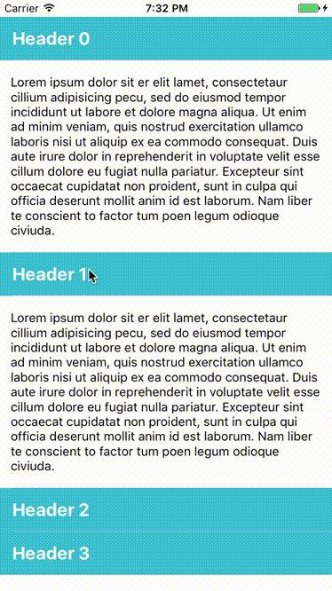

# Savory [](https://github.com/Carthage/Carthage) [](https://raw.githubusercontent.com/Carthage/Carthage/master/LICENSE.md)

**Savory is a swift accordion view implementation.**

   



## Requirements
- Xcode 8.0
- Swift 3.0
- iOS 8

## Installation

- Using [CocoaPods](http://cocoapods.org/):

  ```ruby
  pod 'Savory', :git => 'https://github.com/Nandiin/Savory.git'
  ```
  
- Using [Carthage](https://github.com/Carthage/Carthage):

  ```
  github "Nandiin/Savory"
  ```
  
  then proceed with official steps stated in Carthage [readme](https://github.com/Carthage/Carthage)

- Manually:

  Add the files in Savory folder to your project.
  
## Usage

  ```Swift
  import UIKit
  import Savory
  
  class ViewController: UIViewController, SavoryViewDelegate {

      var savoryView: SavoryView!

      override func viewDidLoad() {
          super.viewDidLoad()

          /* 1. Initiate SavoryView */
          savoryView = SavoryView(frame: view.frame)
          // offset for status bar
          savoryView.frame.origin.y = 20
          savoryView.frame.size.height -= 20 

          /* 2. Provide a implementation of SavoryStateProtivder protocol */
          // Savory providers a simple implementation - SimpleStateProvider
          savoryView.stateProvider = SimpleStateProvider([.expanded, .collapsed, .collapsed])

          /* 3. Set the reuse identifiers for header and body cells */
          savoryView.headerIdentifier = "header"
          savoryView.bodyIdentifier = "body"

          /* 4. register the reuse identifiers */
          savoryView.register(UITableViewCell.self, forCellReuseIdentifier: "header")
          savoryView.register(UITableViewCell.self, forCellReuseIdentifier: "body")

          /* 5. set the savoryDelegate */
          savoryView.savoryDelegate = self

          /* 6. add subview */
          view.addSubview(savoryView)
      }

      func headerCell(forPanelAt index: SavoryPanelIndex, in savoryView: SavoryView) -> SavoryHeaderCell {

          /* Dequeues a reusable cell */
          // SavoryView provides a method to dequeue reusable header cell for certain index
          // SavoryView internally dequeues a cell using its headerIdentifier as reuse identifier
          let cell = savoryView.dequeueReusableHeaderCell(forPanelAt: index)

          /* customize the cell */
          cell.selectionStyle = .none
          cell.textLabel?.text = "Header \(index)"
          cell.backgroundColor = UIColor.lightGray

          return cell
      }

      func bodyCell(forPanelAt index: SavoryPanelIndex, in savoryView: SavoryView) -> SavoryBodyCell {

          // almost same as headerCell(forPanelAt:in:)
          let cell = savoryView.dequeueReusableBodyCell(forPanelAt: index)
          cell.textLabel?.numberOfLines = 0
          cell.textLabel?.text = [String](repeating: "Body \(index)", count: index + 1).joined(separator: "\n")
          return cell
      }
  }
  ```

**Savory** also can be used along with **Interface Builder**:

- Set *Class* filed of a **Table View** to `SavoryView` in the **Identity Inspector**.

- Set *Identifier* fileds of two **Table View Cell**s respectively in the **Attributes Inspector**.

- Connect **Table View** to a view controller as outlet.

- Set the `headerIdentifier`, `bodyIdentifier` properties of the outlet, you should use the values set for **Table View Cell**s above.

- Set `stateProvider` and `savoryDelegate` properties of the outlet.


## Reference

### Glossary

- **Header**: The upper title bar of a accordion panel that consumes user selection event and then toggles the visibility of the **Body**.

- **Body**: The lower view of a accordion panel that typically carrys detail information and would collapse or expand when user taps the corresponding **Header**.

### `SavoryView`

Accordion effect view developed on `UITableView`.

- **`savoryDelegate`**: Delegate that provides header and body cells for the view. It also receives event like `willCollapse`, `willExpand`, `didCollapse`, `didExpand` and `didSelect`.

- **`stateProvider`**: Another delegate that provides the state of the accordion view. SavoryView has `stateProvider.count` number of panels and i-th panel's expand-or-collapse state depends on the value `stateProvider[i]`.

- **`headerIdentifier, bodyIdentifier`**: `SavoryView` uses these properties inside its `dequeueReusableHeaderCell` and `dequeueReusableBodyCell` method to dequeue reusable cells. So make sure these identifiers are registered to the `SavoryView` instance somehow (programatically or in Interface Builder)

- **`dequeueReusableHeader(Body)Cell(forPanelAt:)`**: Like `dequeueReusableCell(withIdentifier:for:)` method for `UITableView`, these methods dequeue reusable cells for panel at certain index.

### `SavoryStateProvider`

`SavoryView` renders its panels as collapsed or expanded based on its `stateProvider` property.

Actually `[SavoryPanelState]` type "conforms to" this protocol naturally. However, because swift hasn't supported an extension like below yet( may come soon according to [apple/swift](https://github.com/apple/swift/blob/master/docs/GenericsManifesto.md#conditional-conformances-))

    extension Array: SavoryStateProvider where Element == SavoryPanelState {} 

Savory provides a wrapper implementation as `SimpleStateProvider` and it requires a `[SavoryPanelState]` for initializing and then it acts just like a stored array from `SavoryView`'s perspective.

For most circumstances, this is sufficient unless you want to provide some complex state managing feature.

Remember to call `reloadData` on `SavoryView` if you provided a custom implementation of `SavoryStateProvider` and it changes its state programatically


## TODO

- [ ] Animation synchronization
- [ ] Custom Animation
- [ ] Find a way to test commit cc2bc43ad436dc4d9d4a1390e68688e54b44ae12
- [ ] @IBDesignable


## License
Savory is released under the MIT license. See [LICENSE](LICENSE) for details.
